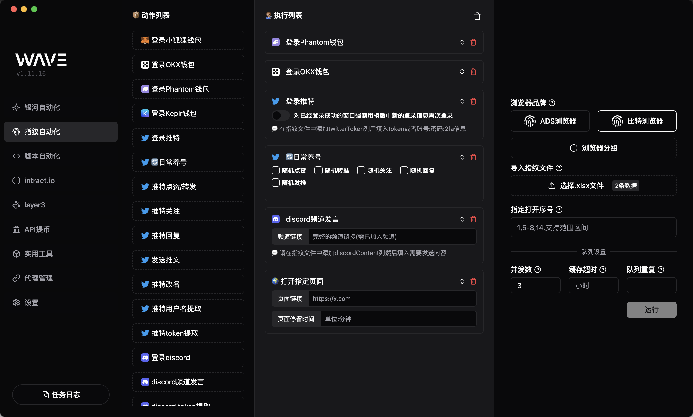
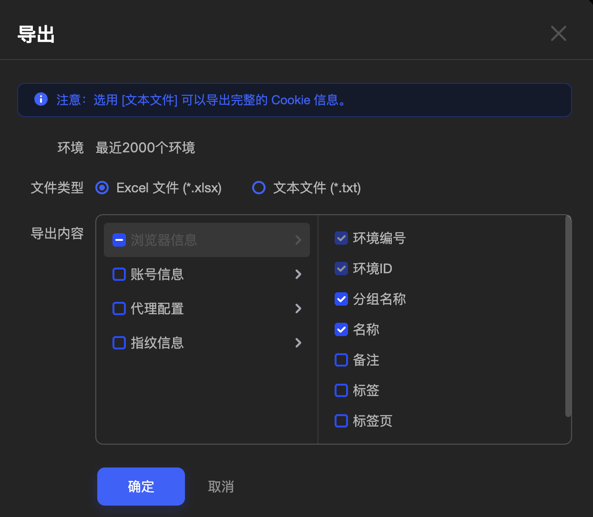
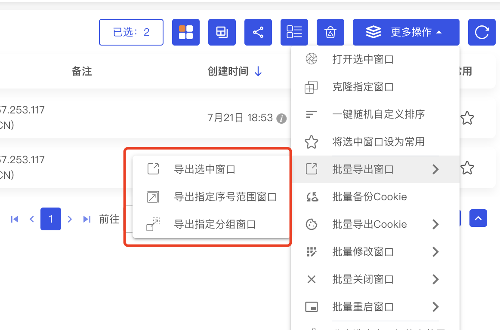
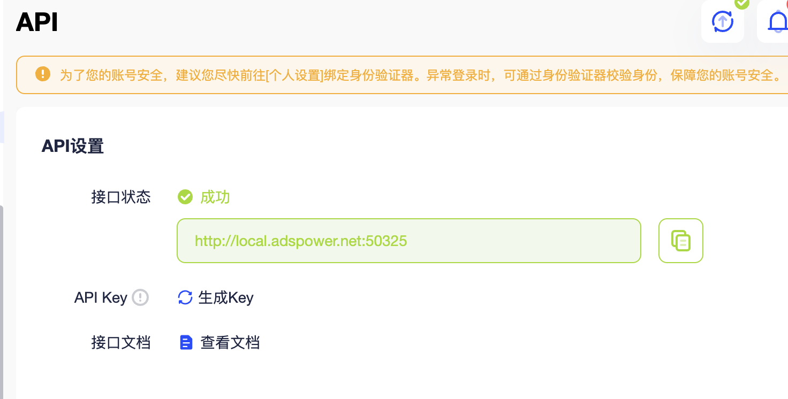
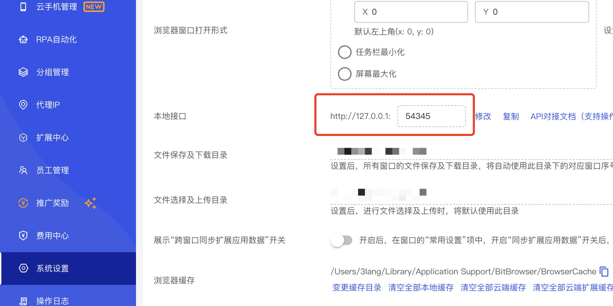
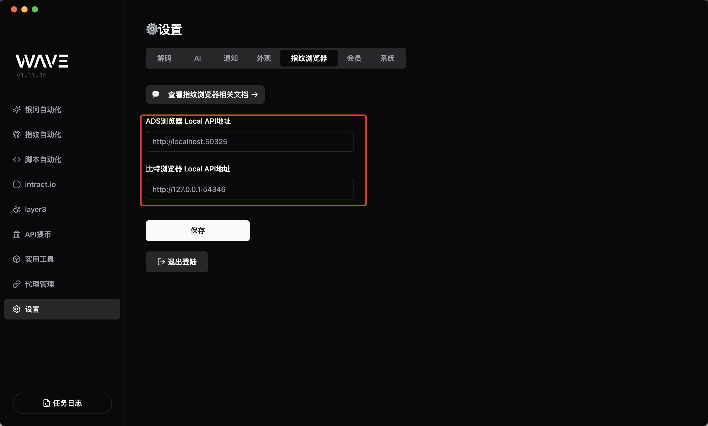

# 指纹浏览器模块

使用 wave 的指纹浏览器模块, 可以轻松完成推特, Discord 等繁琐重复的操作, 还能一键进行推特日常养号, 支持 AdsPower 和比特浏览器

## 自定义动作

- 支持推文转发, 点赞
- 支持推文评论
- 支持发推文
- 支持用户关注
- 支持`discord`消息发送
- 支持提取`twitter`、`discord` token

### 获取指纹导入文件

部分交互需要用户提供额外信息(例:发推,dc 发言),在指纹浏览器导出的文件中添加对应列内容后在此上传

#### ADS 浏览器导出窗口

#### 比特浏览器导出窗口

> 注意: 比特浏览器导出时,第二行为说明内容, 记得删除后再在`wave`中使用

#### 指纹文件自定义字段说明

> 在导出的指纹文件中, 可以添加以下自定义字段, 以便在`wave`中使用

- `mnemonic`: 助记词,登录钱包需要
- `twitterToken`: 推特登录信息,支持`token`和`账号:密码:2FA`两种格式
- `twitterContent`: 进行发推或者回复推文时，自定义推文内容
- `twitterName`: 进行推特改名交互时，自定义推特名称
- `discordToken`: dc 登录信息,支持`token`和`账号:密码:2FA`两种格式
- `discordContent`: 进行 dc 频道发言时，自定义发言内容

### 调整指纹浏览器 API 设置

AdsPower API 获取

BitBrowser API 获取

在 Wave 中设置指纹浏览器 API

