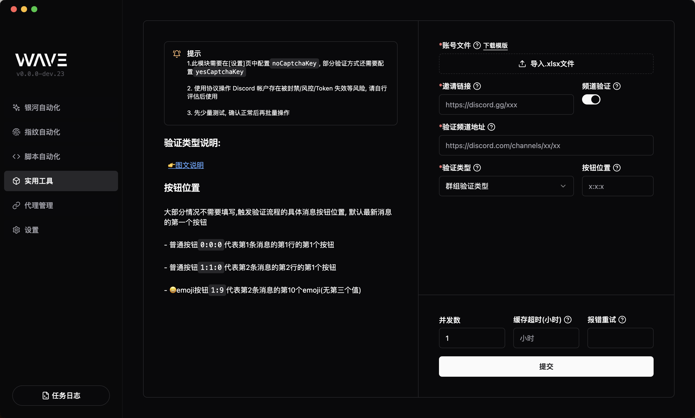
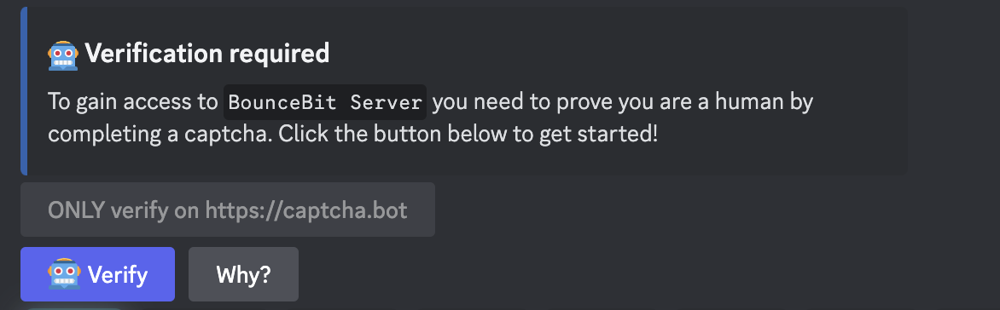
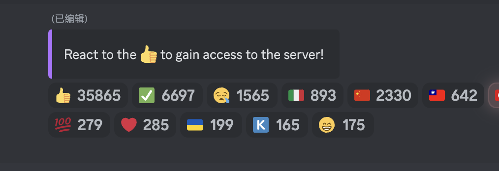
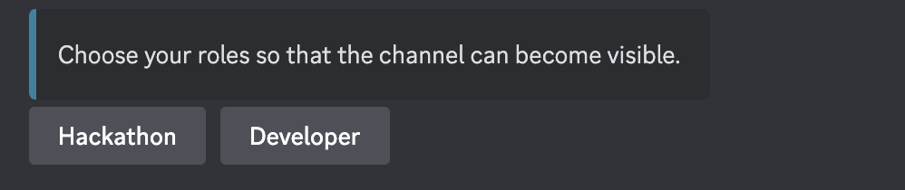
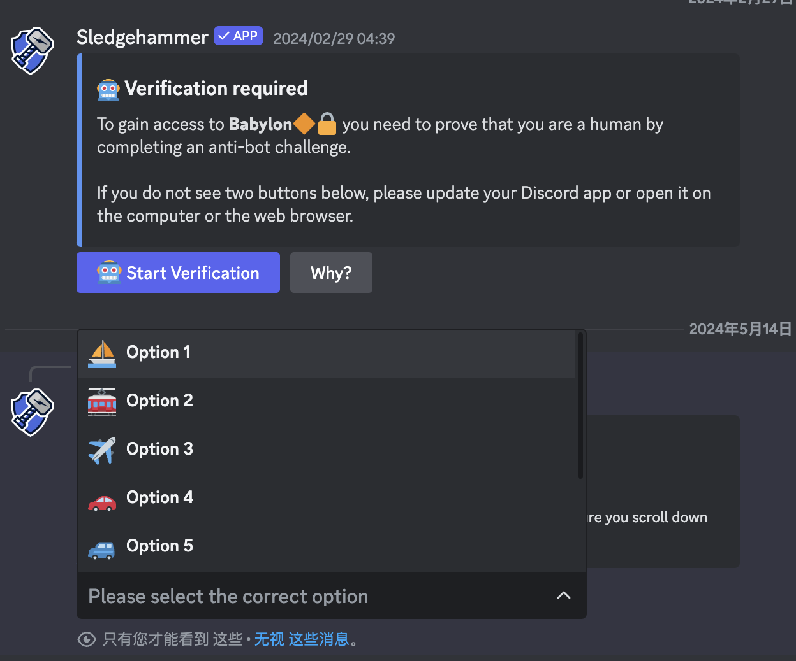
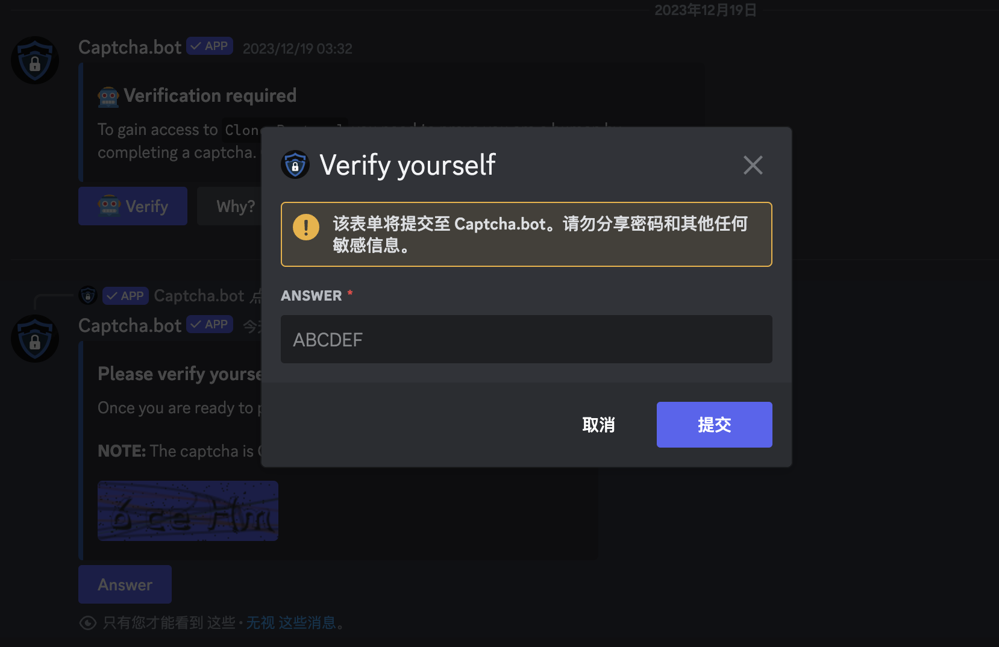
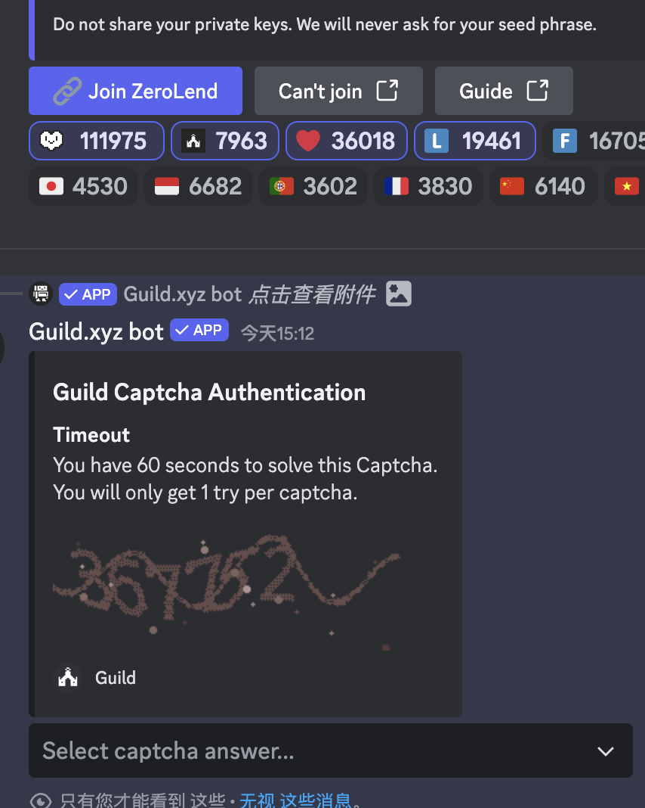
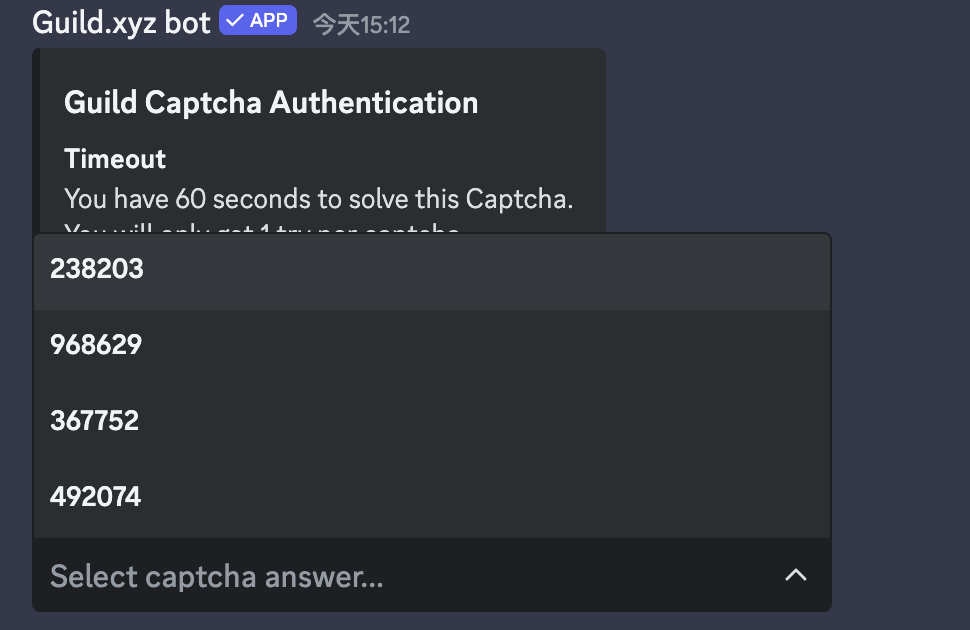
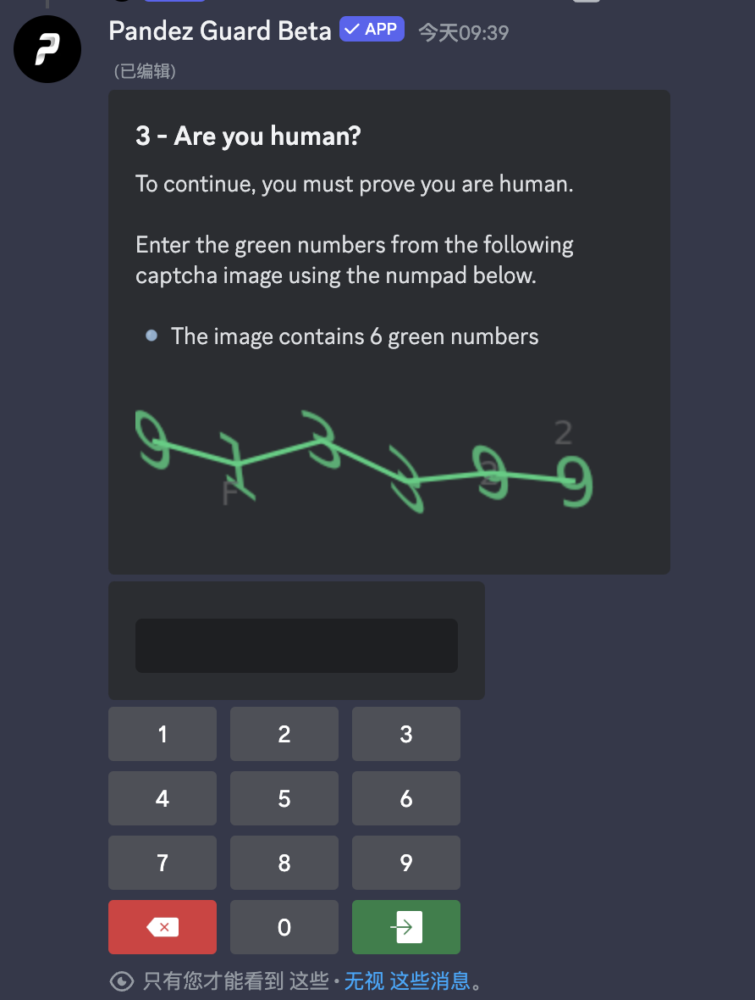

# Discord 加群

Wave 支持自动加入 Discord 群组并支持支持 ✅ 通过大部分频道验证

::: warning
使用协议操作 Discord 帐户存在被封禁/风控/Token 失效等风险, 请自行评估后使用
:::

## 使用说明

### 前置准备

此模块需要在**设置页**中配置`noCaptchaKey`, 部分验证方式还需要配置`yesCaptchaKey`

### 模版文件

点击下载模版文件，填入对应字段信息，保存文件

#### 模版字段说明

- `discordToken` discord 账号 token
- `proxy` 代理地址, 格式:IP:端口:用户名:密码:协议类型(http 或 socks5)

::: warning
强烈建议配合优质的代理使用, 降低账号被风控的几率
:::

### 邀请链接

群组的要求链接, `https://discord.gg/xxxx`

### 频道验证

大部分群组需要在进入后前往特定频道验证, 通过后才能正式加入群组, 此时就需要打开此开关

### 验证频道地址

进行验证的频道地址, 格式: `https://discord.com/channels/xxxx/xxxx`

### 按钮位置(大部分情况不需要填写)

触发验证流程的具体消息按钮位置, 默认最后一条消息的第一个按钮触发验证流程

#### 需要配置的情况

下面这条验证消息就不是第一个按钮(第一个按钮是灰色的 Only verify on...), 需要填写按钮位置: 0:1:0

- `0`代表第一条消息
- `1`代表按钮在第二行
- `0`代表按钮在第一列

## 验证类型

下面对支持的验证类型进行说明, 目前支持以下几种验证类型

## 点击 emoji 按钮

- 最新消息的第 1 个 emoji 按钮, 可以不填写按钮位置(如上图)
- 第 1 条消息的第 3 个 emoji 按钮, 按钮位置为`0:2`
- 第 2 条消息的第 8 个 emoji 按钮, 按钮位置为`1:7`

> emoji 类型`按钮位置`没有第三个参数

## 点击普通按钮

## 下拉框选择匹配项

根据文本内容选择匹配项, 例如下拉选择对应的选项

## 弹框输入验证码

点击验证按钮, 然后出现验证码图片, 点击回复弹出输入框

## 下拉框选择验证码

点击验证按钮, 然后出现验证码图片和下拉框

## 键盘输入验证码

点击验证按钮, 然后出现验证码图片和小键盘

