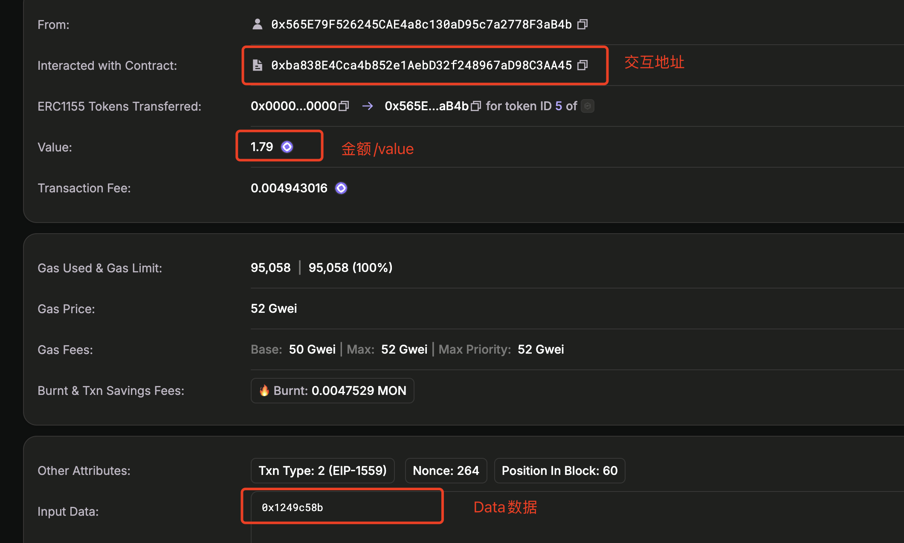
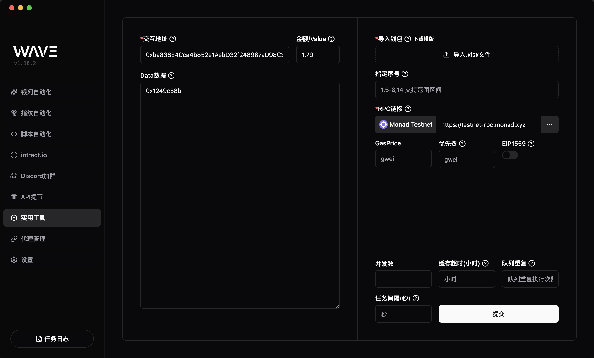
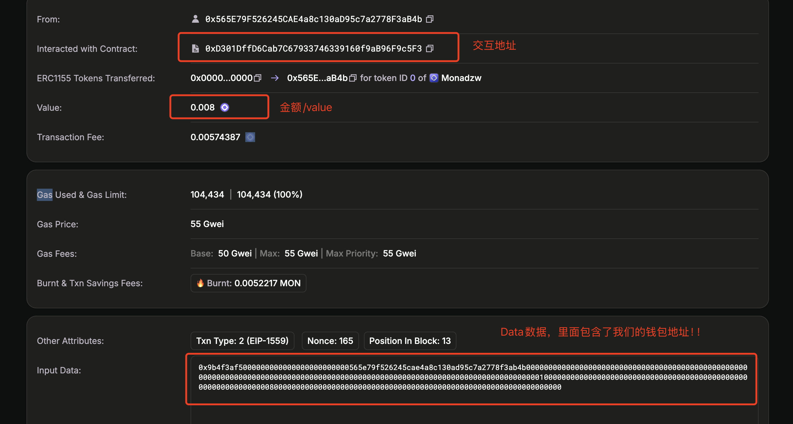

# 万能上链器

左侧菜单 -> `常用工具` -> `万能上链器`

## 第一种:固定Data数据

### 找到需要的参数

我们根据这个[Monad 测试网 tx](https://testnet.monadexplorer.com/tx/0x9996a2d8ee95a872a57fac6bafc04a6104ec1c289db9fa368d9bbaedf98334bb)来演示基础的使用方法

- `交互地址`：钱包交互的合约地址
- `金额/value`: 交互的金额
- `Data数据`: 交互的`input data`数据

### 填写参数

将上面找到的参数填写到对应的输入框中,导入模版,设置运行参数,点击开始运行

## 第二种:固定Data数据

### 找到需要的参数

我们根据这个[Monad 测试网 tx](https://testnet.monadexplorer.com/tx/0x6f6e05876a2dbef9107e3c7d550b94a9c18e91aceb8303614c9aba6c0d40c61a)来演示需要替换`data`中的`address`的情况

- `Data数据`: 交互的`input data`数据包含钱包地址，需要替换成`{address}`!!!

## 填写参数

将`data`中的钱包地址改成`{address}`后,导入模版,设置运行参数,点击开始运行

