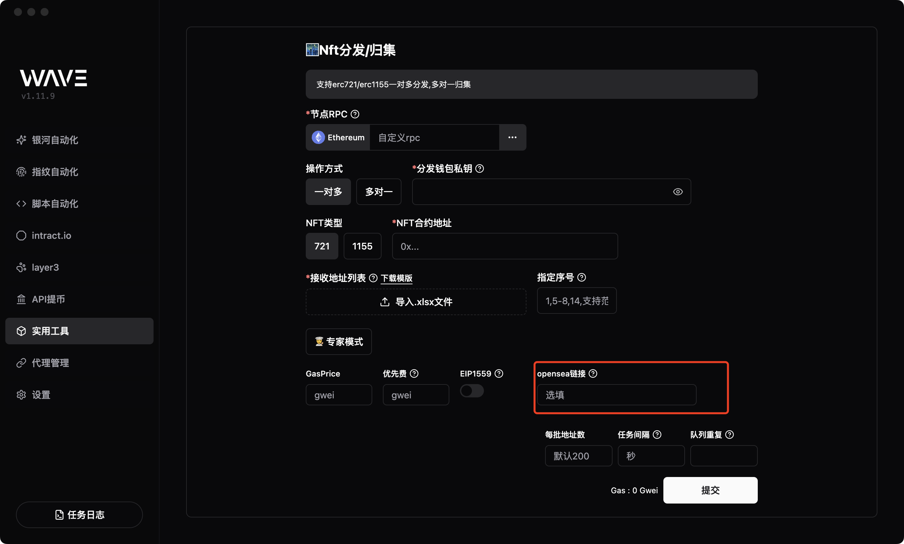

# NFT 批量转账

- 支持 erc721、erc1155 nft 批量转账

## ERC721 NFT 批量转账

erc721 NFT批量转账每个nft都需要单独提供tokenId,有两种方式提供tokenId

- 模版tokendId列
- [🌟推荐方式]Wave自带了获取方式,打开专家模式按钮,填入 OpenSea合集链接即可,例如:https://opensea.io/zh-CN/collection/apekin-1

## ERC1155 NFT 批量转账

erc1155 NFT 批量转账只需要提供目标 NFT 的合约地址和 tokenId,即可
