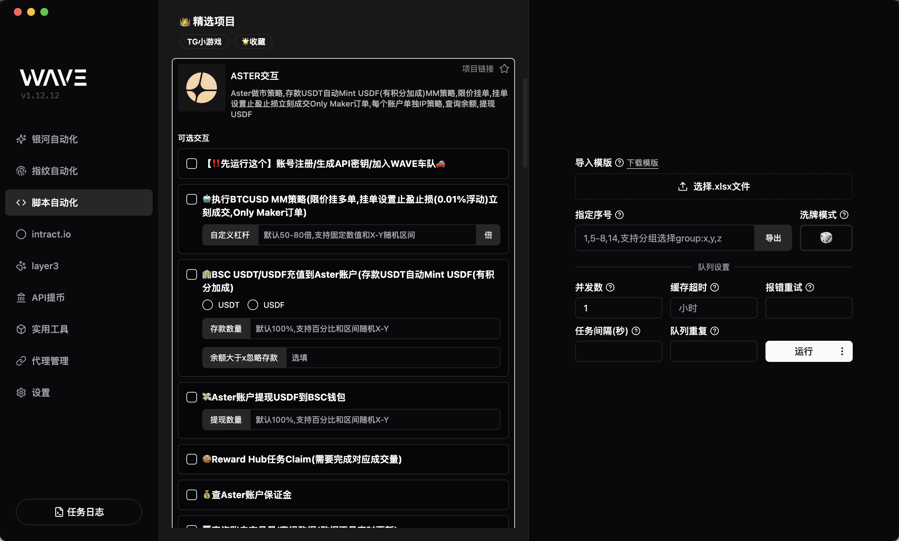
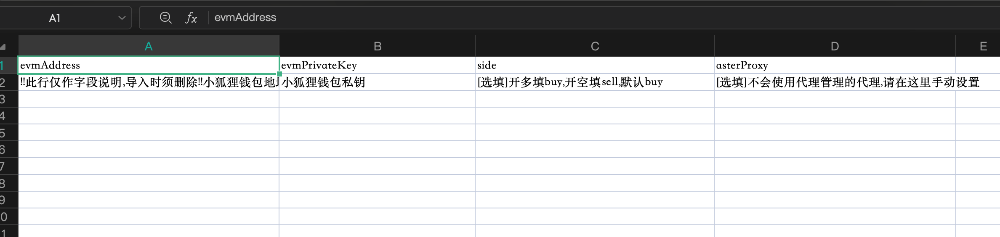
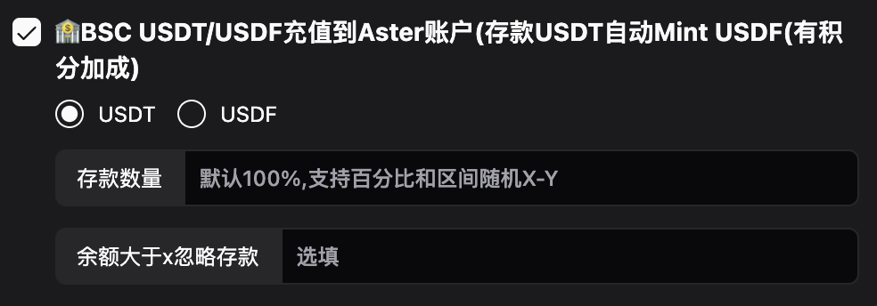
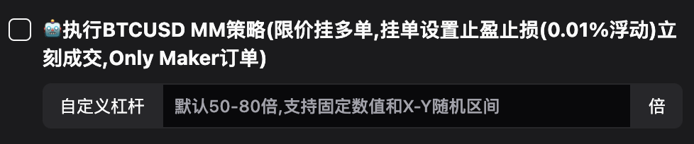
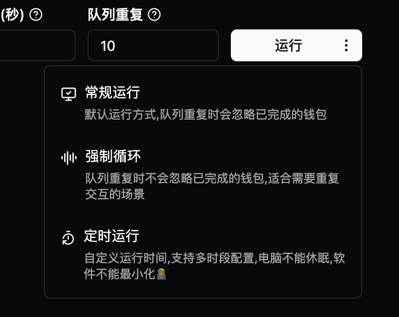

# ASTER 交互

## 简介

Aster 做市策略,存款 USDT 自动 Mint USDF(有积分加成)MM 策略,限价挂单,挂单设置止盈止损立刻成交 Only Maker 订单,每个账户单独 IP 策略,查询余额,提现 USDF

### 模版说明

- `evmAddress`: 钱包地址
- `evmPrivateKey`: 钱包私钥
- `side`: 选填,交易方向: `buy`做多, `sell`做空,默认 `buy`
- `asterProxy`: 选填,不会使用代理管理的代理,请在这里手动设置,格式和代理管理一致

### 交互说明

进入 Wave `脚本自动化`选择`ASTER交互`, 选择模版文件, 点击 `导入模版`

#### 1.注册 ASTER

勾选`【‼️先运行这个】账号注册/生成API密钥/加入WAVE车队🚗`动作,点击运行

::: danger
‼️ 只有加入 wave 车队的钱包才能自动化交易
:::

#### 2.充值到 Aster 账户

- 选择是存入`USDT`还是`USDF`
- 填`存款数量`（默认 100%,确保钱包在`BSC`链上有对应数量的余额）
- 点击运行 4.自动化交易: 勾选`🤖执行BTCUSD MM策略`动作

#### 3.运行 BTCUSD MM 策略

- 勾选`🤖执行BTCUSD MM策略`动作
- (可选)设置杠杆,默认 50-80 倍,支持固定数值和 X-Y 随机区间
- 点击运行

#### 4.循环执行

基于上一步的设置,点击运行按钮旁边的三个点

- `强制循环`: 选择后,脚本会一直循环执行`队列重复`次数
- `定时运行`: 选择后,脚本会每隔`间隔时间`分钟执行一次
