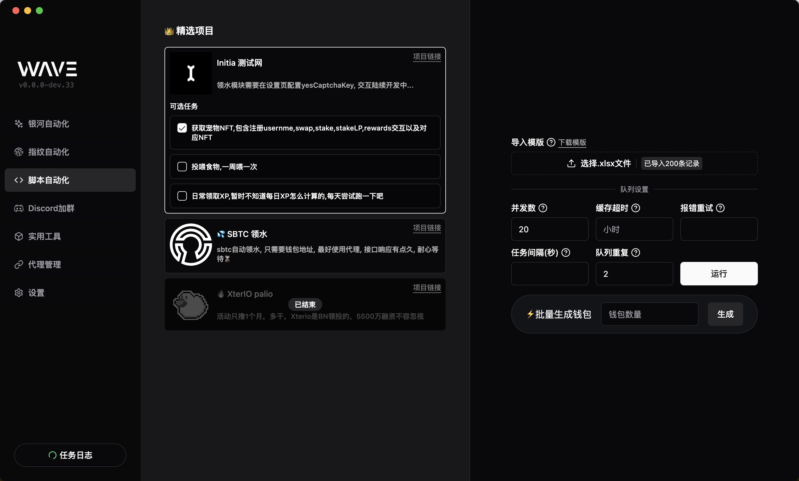
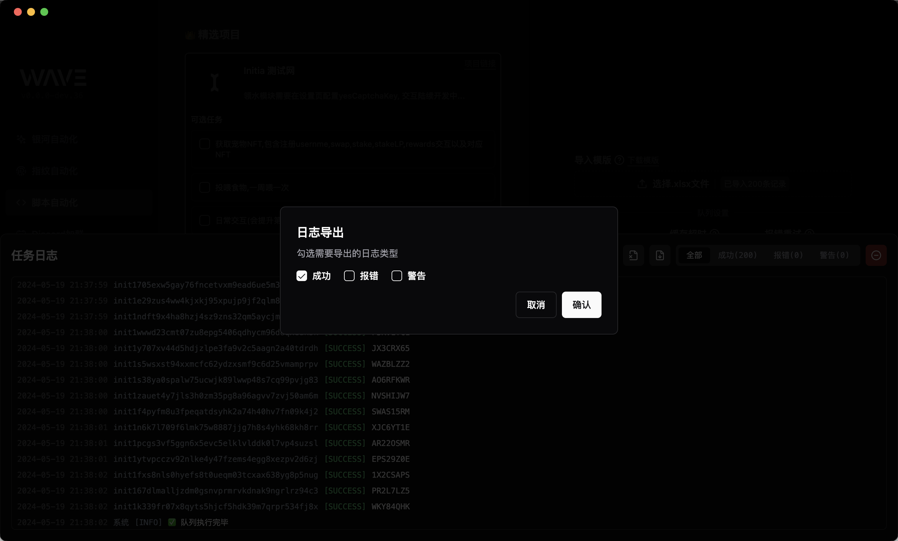
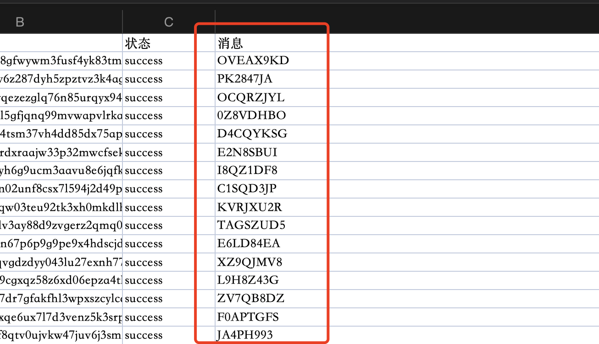
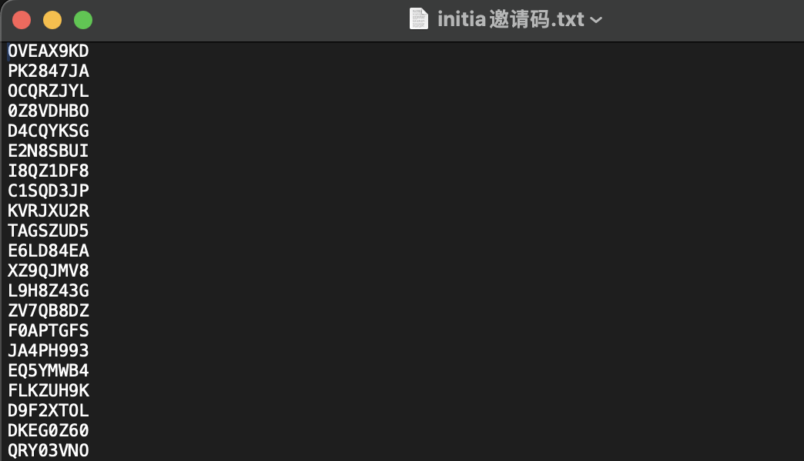
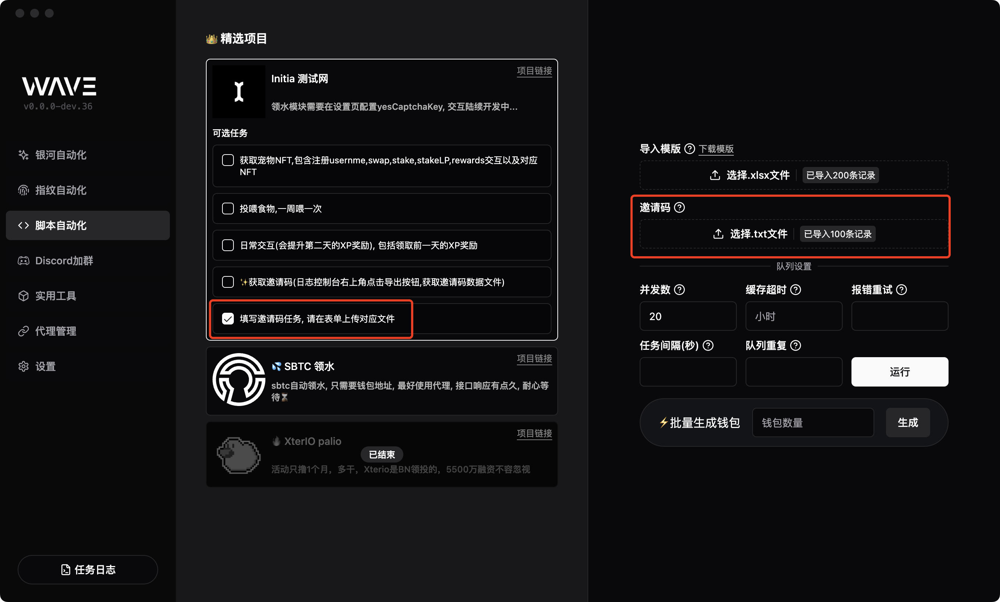

# Initia 测试网交互

## 步骤说明

### 前提条件

需要准备已经领好水账号, 否则无法进行后续操作(光有余额不行, 领取宠物 NFT,一定需要完成领水任务)

### 1.获取宠物 NFT

软件界面, 购选 `获取宠物NFT,包含注册usernme,swap,stake,stakeLP,rewards交互以及对应NFT` 选项, 导入模版文件, 配置参数, 点击 `开始` 按钮, 等待交互完成.

> 建议参数: 并发数: 20, 报错重试: 2, 队列重复: 3, 每 100 个账号大概需要 50 分钟

### 2.投喂宠物

软件界面, 购选 `投喂食物,一周喂一次` 选项, 导入模版文件, 配置参数, 点击 `开始` 按钮, 等待交互完成.

抽取食物的现在不会立即到账, 一般延迟 30 分钟左右才能拿到实物, 这里建议分两次操作, 第一次操作完后, 等个 20-30 分钟再重复跑一次

> 建议参数: 并发数: 20, 报错重试: 2, 队列重复: 3, 每 100 个账号大概需要 30 分钟

### 3.日常交互

日常交互, 包括领取前一天的XP奖励, 购选 `日常交互` 选项, 导入模版文件, 配置参数, 点击 `开始` 按钮, 等待交互完成.

> 建议参数: 并发数: 15, 报错重试: 2, 队列重复: 3, 每 100 个账号大概需要 10 分钟

### 4.邀请码任务

 

#### 获取邀请码

勾选 `✨获取邀请码` 选项, 导入账号文件, 配置参数, 点击 `开始` 按钮, 等待日志输出邀请码, 保存到文件, 参考下图

导出日志, 保存到文件, 参考下图

找到日志文件中的邀请码, 复制, 参考下图

将复制的邀请码, 保存到一个 txt 文件中, 一行一个, 参考下图

 

#### 完成任务

- 勾选 `填写邀请码任务` 选项, 上传账号文件, 上传邀请码文件, 配置参数, 点击 `开始` 按钮, 等待交互完成.

