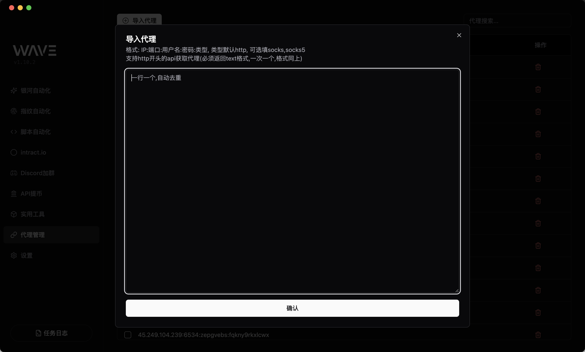
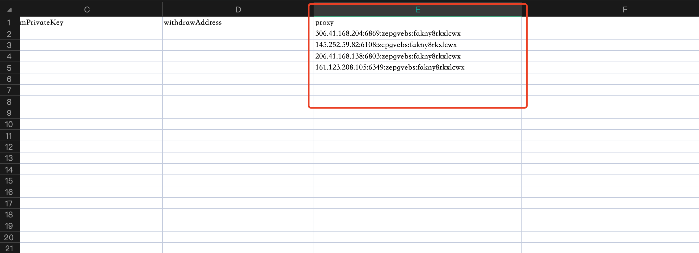

# 代理设置

## 方式一：全局方式

左侧菜单 -> `代理管理`

按格式导入代理之后，全部项目都会随机取代理使用，如果表格设置了`proxy`，优先用表格的代理

格式支持(默认 http):

- `ip:port:user:pass`
- `ip:port:user:pass:socks5`
- `ip:port:user:pass:http`
- `http`开头的api地址(api获取代理)

## 方式二：模版一对一配置

所有项目模版都支持设置`proxy`，格式跟代理管理一致，这样钱包和代理就一对一匹配了

