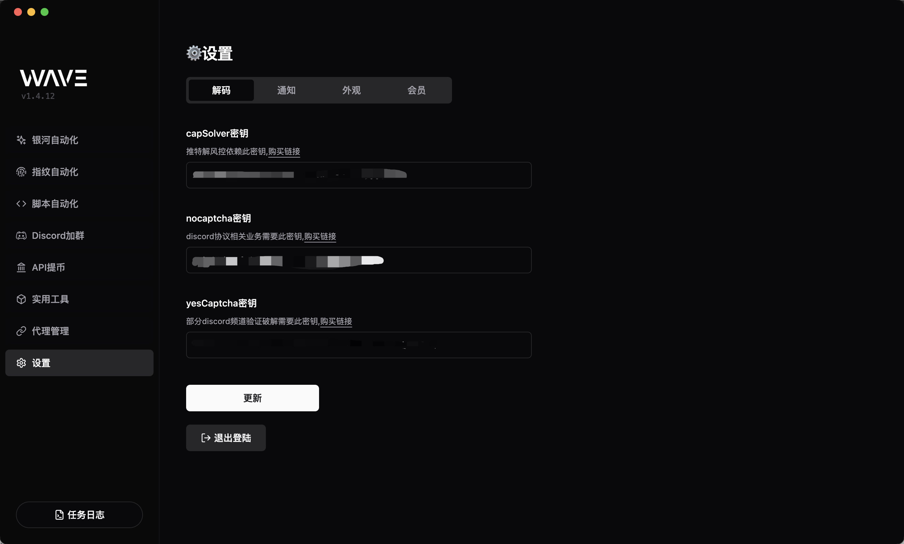
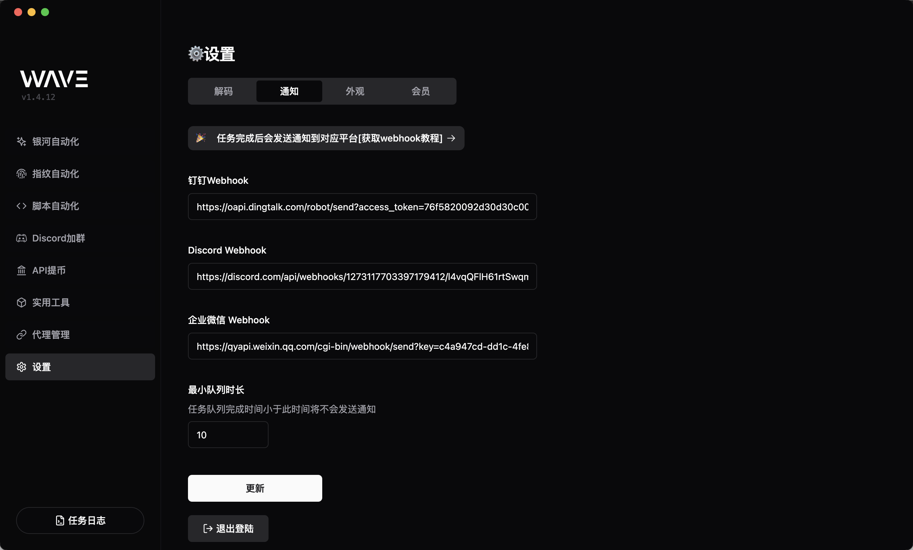

# 设置模块

设置模块是一个用于管理系统设置的模块，它提供了一个统一的设置入口，用户可以通过设置模块来修改系统的设置。

## 解码相关配置

- `capSolver`密钥: 验证码解码器，推特解风控依赖此密钥, [购买连接](https://dashboard.capsolver.com/passport/register?inviteCode=sIgarOnCZkoO)
- `nocaptcha`密钥: discord 协议相关业务需要此密钥, [购买连接](https://www.nocaptcha.io/register?c=M3KYU5)
- `yesCaptcha`密钥: 部分 discord 频道验证破解需要此密钥, [购买连接](https://yescaptcha.com/i/of0Uy9)

## 通知配置

配置对应平台的`webhook`链接，可以在任务完成后推送通知到对应的平台。

### 获取钉钉 webhook

- 在钉钉中创建一个群聊。
- 在群聊中点击设置，选择“智能群助手”。
- 点击“添加机器人”并选择“自定义机器人”。
- 设置机器人名称、头像等，然后点击“下一步”。
- 安全配置只勾选关键字, 添加关键词`wave`
- 复制 `Webhook URL`

### 获取企业微信 webhook

- 在企业微信中，进入你要发送消息的群聊。
- 在群聊中点击右上角的“设置”按钮。
- 选择“群机器人”。
- 点击“添加机器人”，选择“自定义机器人”。
- 按照提示完成配置，并获取 `Webhook URL`

### 获取 Discord webhook

- 在 `Discord` 服务器中，点击您想要发送消息的频道的设置（右键频道名称 -> 编辑频道）。
- 在左侧菜单中选择“集成”。
- 点击“创建 Webhook”。
- 设置 Webhook 的名称、头像，并选择发送消息的频道。
- 点击`复制 Webhook URL`

