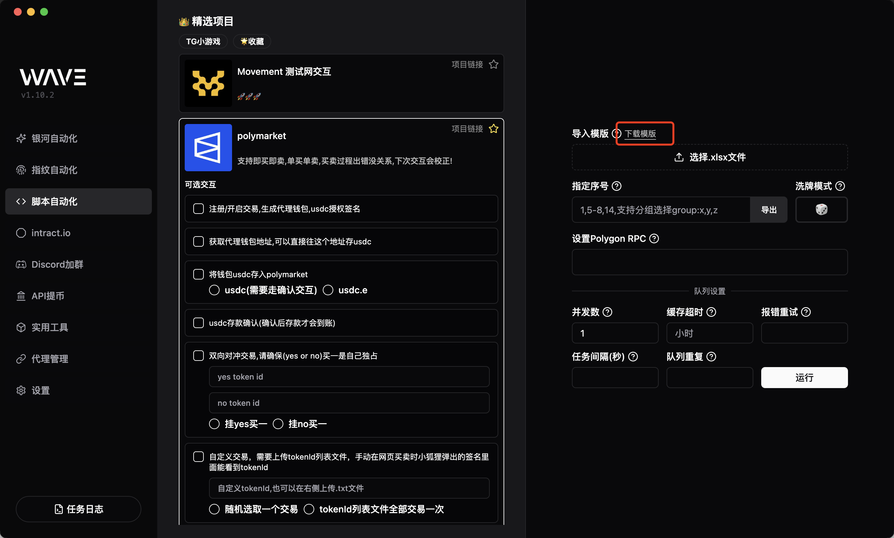
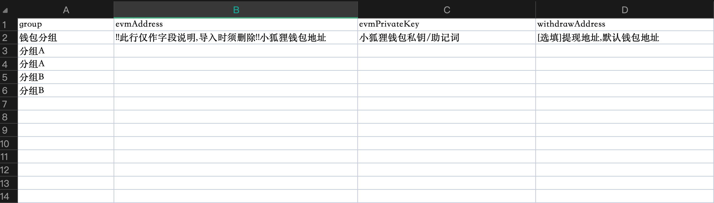
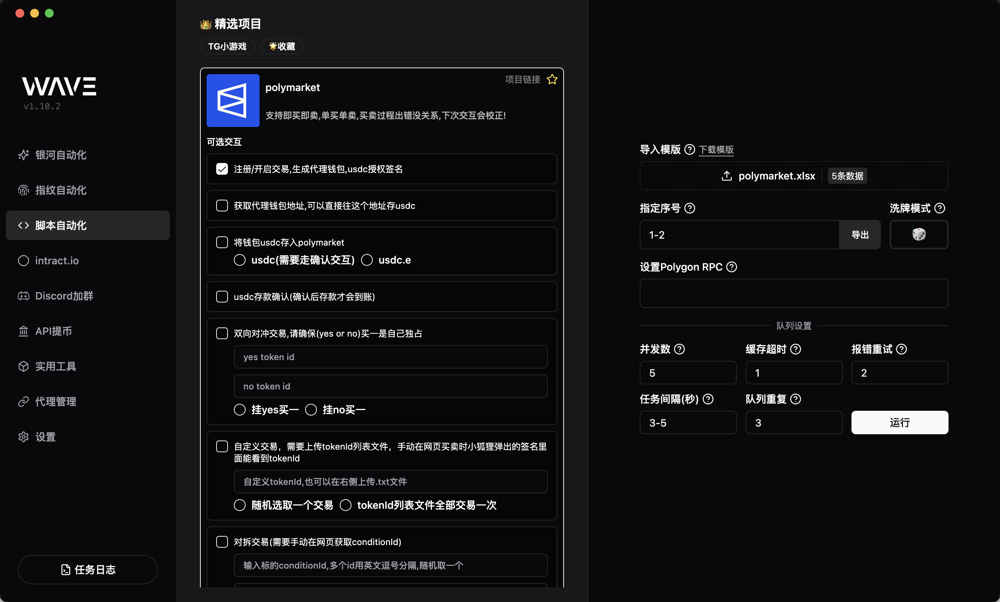
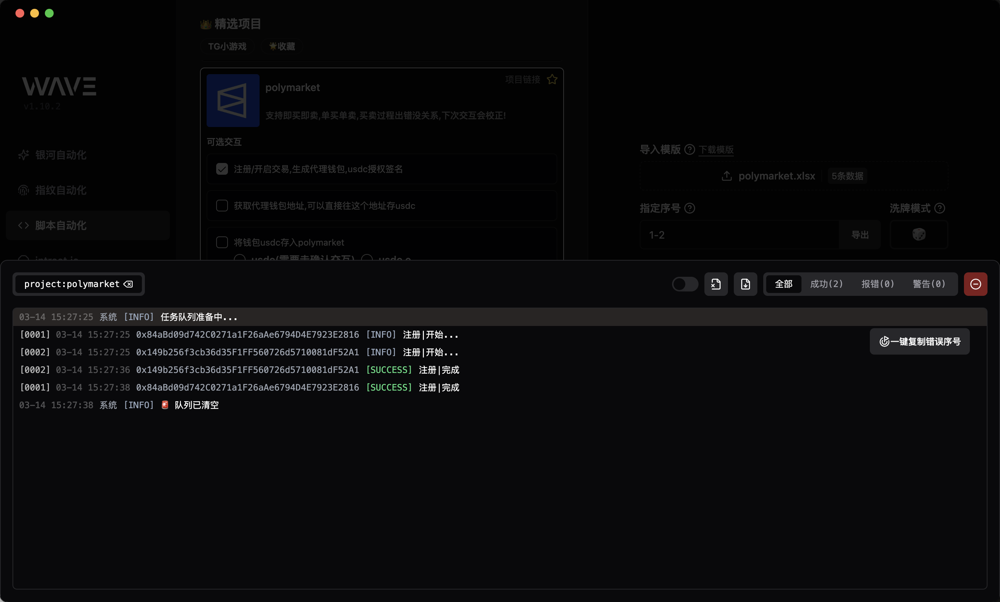

# 基础使用

基础运行流程: 勾选项目-下载模板-填写模板信息-导入模板-勾选交互-开始运行

> 多号建议配置代理, 代理设置教程[在这](/proxies)👈

## 下载项目模板

**每个项目都有对应的模板**，可以在项目界面中下载

## 填写模板信息

按照模版第二行说明(🔥 记得删除掉这一行),填写好对应内容,保存模版

## 导入模板,设置运行参数

绝大部分情况下,只需要设置`运行参数`和`指定序号`即可

- `指定序号`: `1,5-8,14`,意思是指定第1行，5-8行，第14行去执行，其他的不执行, `group:分组a,分组b` 意思是指定模版中`group`值是`分组a`和`分组b`的执行
- `并发数`: 同时运行的钱包数量,wave并发和电脑cpu数量无关,只受梯子和代理的限制
- `任务间隔`: 每个钱包之间间隔多久跑，设置10就是间隔10秒，设置1-10 就是1-10 之间随机取例如8秒间隔
- `缓存超时`: 代表在X小时后可忽略缓存再次执行任务，如果设置1，意思是，1小时内你重复跑同个任务，会提示`已完成,完成时间2025/3/14 15:27:38`
- `报错重试`: 任务如果失败了，需要重试吗?设置2就是重试2次
- `队列重复`: 例如 10 个钱包，跑完一轮，还需要重复跑多几轮，就设置这个值，例如设置 2，就会把全部钱包跑完一轮之后再跑一轮,需要注意的是,只会重复任务异常的钱包

### 运行程序

开始运行后，脚本就开始跑了，日志输出面板支持导出日志

