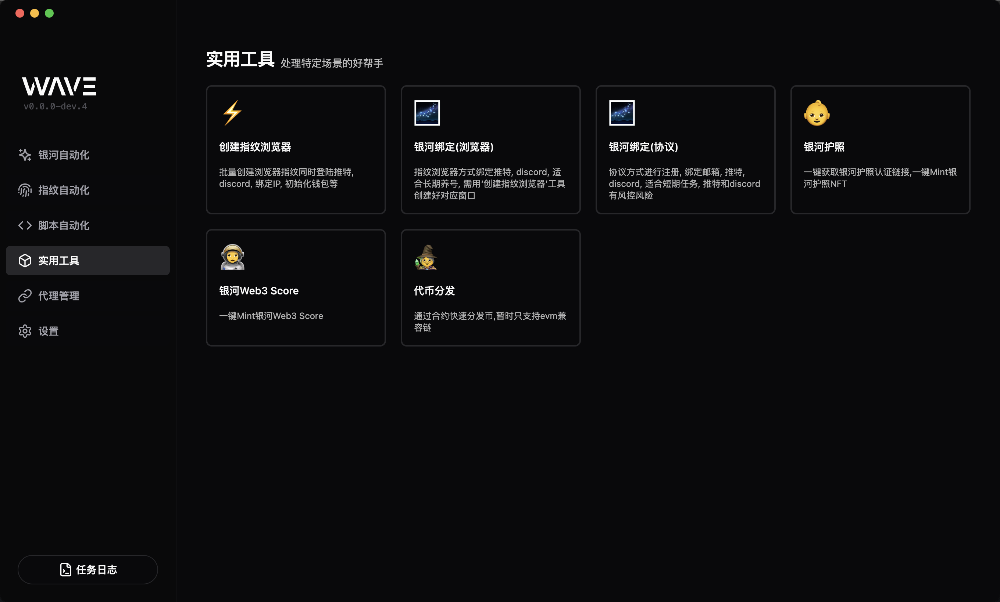
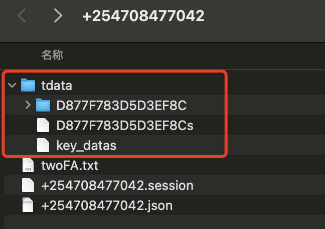
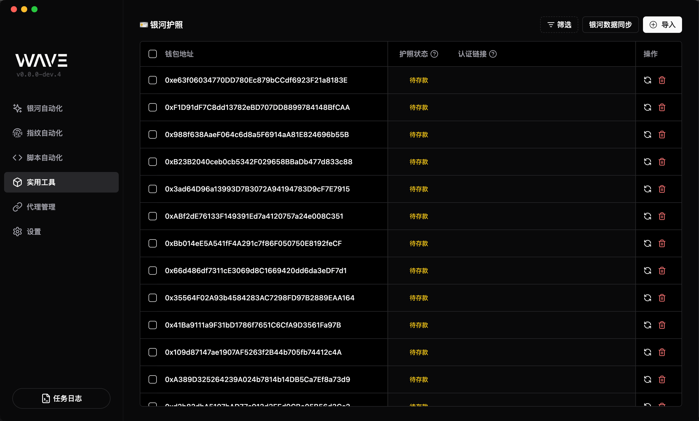
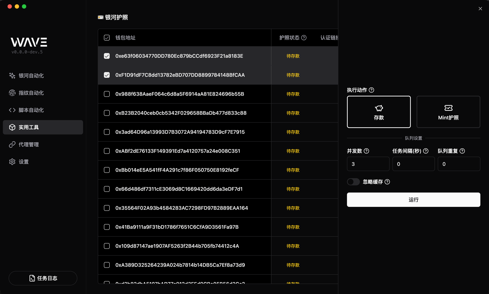
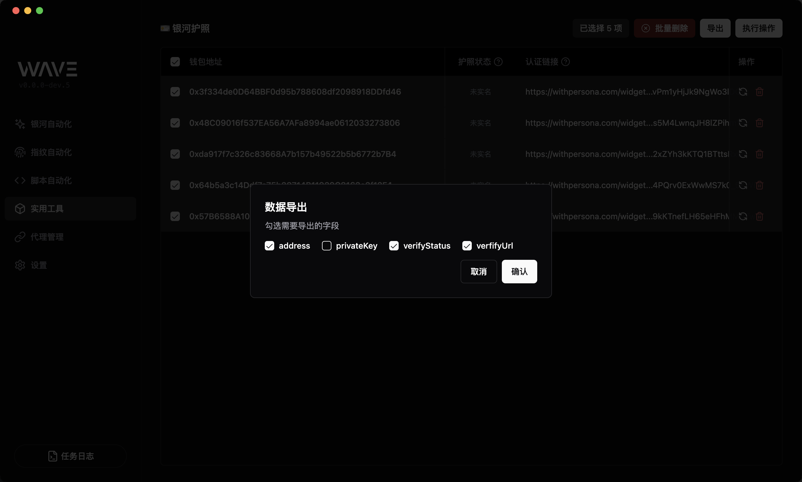
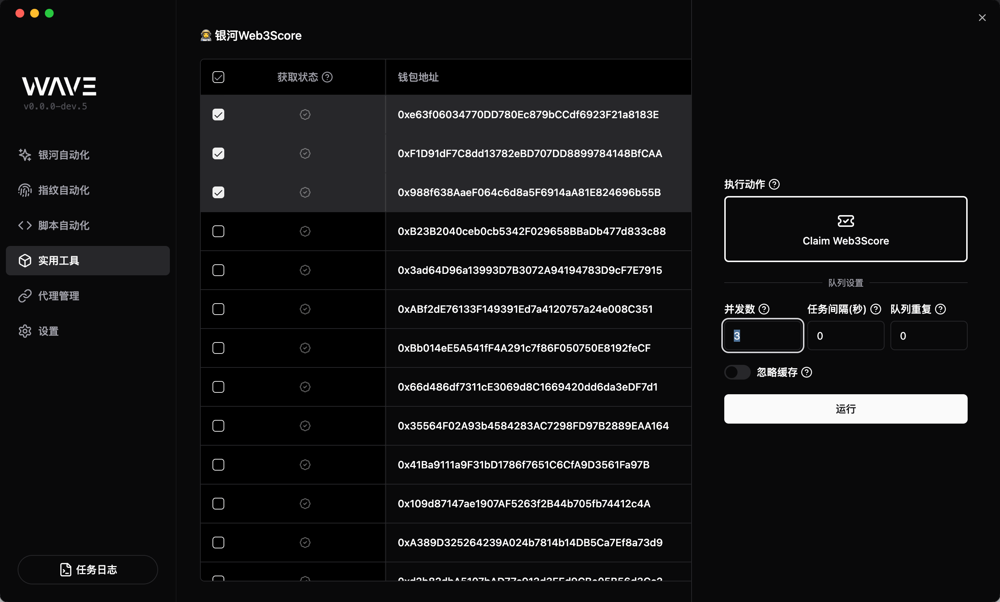
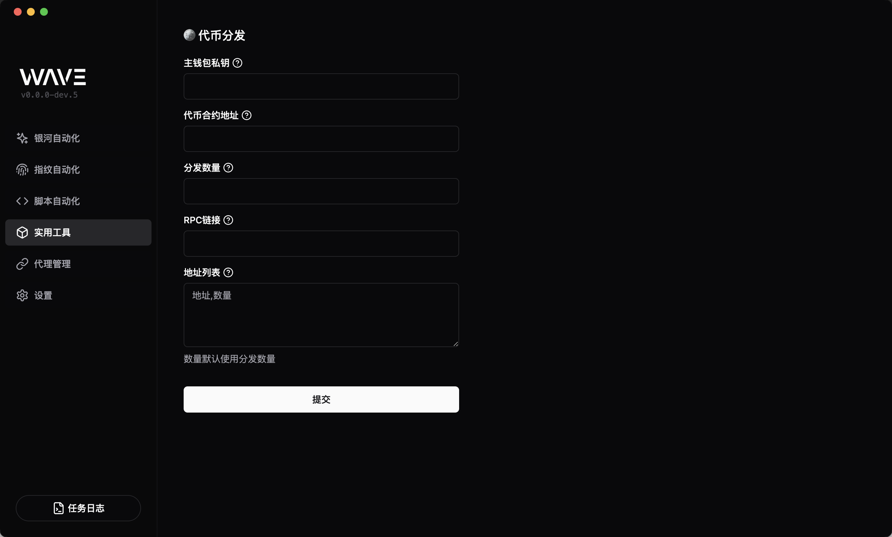

# 工具模块

wave 工具模块提供了各种各样的工具, 例如批量创建指纹浏览器, 银河账号绑定, 代币分发等功能, 方便用户快速完成批量化操作。

## 批量创建指纹浏览器

通过导入模版文件, 可以快速创建指纹浏览器, 同时完成额外操作, 提高效率。

- 支持登录`Twitter`
  - `token`登录,`twitterToken`格式: `token`
  - `2fa`登录,`twitterToken`格式: `token,用户名,密码,2fa密钥`,会优先尝试`token`登录, 失败后会尝试`2fa`登录
- 支持登录`Discord`
- 支持`tdata文件夹`形式登录 `Telegram`(模版中设置`tgTdata`字段)
- 支持初始化小狐狸账号
  - 支持助记词导入(模版文件中设置`seed`字段)
  - 支持私钥导入(模版文件中设置`privateKey`字段)

:::warning 初始化小狐狸账号
需要在对应指纹浏览器中开启小狐狸拓展插件, 默认解锁密码为`11111111`
:::

### Telegram tdata 说明

- `tdata` 是`telegram`便携版客户端快捷登录文件夹, 号商那里一般都会提供
- 填写的路径格式为: `xxx/xxx/电话号码`, 例如:

  - mac: `/Users/3lang/Desktop/+254708477042`
  - mac: `/Users/3lang/Desktop/254708477042`
  - windows: `C:\Users\3lang\Desktop\+254768930500`
  - windows: `C:\Users\3lang\Desktop\254768930500`

- 请确保提供的文件夹内有`tdata`文件夹, 且文件夹内有`D877F783D5D3EF8C`文件夹, 大小写不敏感
  

:::info
绑定了 2FA 的账号，登陆时可能需要密码, 此时路径格式为: `C:\Users\3lang\Desktop\+254768930500,密码`, 英文逗号`,`分隔, 逗号后面是密码
:::

:::warning
`telegram`封号验证，尽量固定`代理ip`, `tg`只支持`socks5`代理

- 指纹浏览器场景中使用模版中设置的`proxy`字段, 软件会尝试将非`socks5`代理转换为`socks5`代理使用，如果服务商不支持则会链接报错
- 脚本/协议场景中使用模版中的`tgproxy`字段

:::

## 银河账号绑定(指纹浏览器方式)

- 支持银河账号绑定 Twitter(需要指纹浏览器已登录推特)
- 支持银河账号绑定 Discord(需要指纹浏览器已登录 Discord)

## 银河账号绑定(协议方式)

- 支持银河账号绑定邮箱(需要模版文件填写`email`字段),不支持`gmail`邮箱
- 支持银河账号绑定`Twitter`(需要模版文件填写`twitterToken`字段)
- 支持银河账号绑定`Discord`(需要模版文件填写`discordToken`字段)
- 支持银河账号绑定`Telegram`(需要模版文件填写`tgTdata`字段), [tdata 说明](#telegram-tdata-说明)
  - 模版支持`tgproxy`字段，设置`telegram`代理, 只支持`socks5`代理, 格式: `IP:端口:用户名:密码:socks5`

## 银河护照

全面支持银河护照相关操作:

- 护照预存款
- 获取/导出护照 KYC 链接
- 通过 KYC 后, 支持 Claim 护照

> 护照默认密码为: aA12345678!

### 获取护照状态

- 点击右上角`导入`按钮, 填入钱包私钥, 一行一个
- 点击右上角`银河数据同步`按钮, 同步护照状态

#### 护照状态说明

- `待存款`: 等待用户存款
- `未实名`: 已预存款, 等待 KYC 通过, 此状态会同步获取 KYC 链接
- `已实名`: 已通过 KYC, 可以 Claim 护照
- `已领取`: 已拥有护照
- `已领取(V2)`: 护照已升级为 v2
- `V2升级失败`: 护照升级 v2 时失败，需要找银河客服处理
- `审核被拒`: KYC 审核被拒, 可能需要换个钱包重新 KYC, 或者手动去银河查看具体被拒原因

### 预存款

确保钱包内有相应余额

- 勾选需要预存款的记录
- 点击右上角`执行操作`按钮, 选择`存款`类型
- [可选]设置适当的队列属性
- 点击`运行`按钮

### 获取/导出 KYC 链接

- 点击右上角`银河数据同步`按钮, 同步护照状态
- 勾选状态为`未实名`的记录
- 点击右上角`导出`按钮, 在弹出的对话框中勾选需要导出的字段

### Claim 护照

确保钱包内有余额支付 Gas 费

- 勾选状态为`已实名`的记录
- 点击右上角`执行操作`按钮, 选择`Mint护照`类型
- [可选]设置适当的队列属性
- 点击`运行`按钮

## 银河 Web3Score

支持银河 Web3Score 相关操作:

- 获取 Web3Score 状态
- 支持 Claim Web3Score

### Claim Web3Score

确保钱包在 Polygon 链上有**价值大于 5USD 的 Matic**余额

- 勾选状态为`未拥有`的记录
- 点击右上角`执行操作`按钮, 选择`Mint Web3Score`类型
- [可选]设置适当的队列属性
- 点击`运行`按钮

## 代币分发

代币分发模块支持一键批量分发代币, 通过合约分发的方式, 提高追踪难度。

> 此分发方式主钱包会部署一个合约(**同一个 rpc 下只会部署一次**), 然后通过合约分发代币, 无需担心代币被追踪, 暂时只支持 evm 链

- 填写分发的主钱包私钥
- [可选]填写分发代币地址, `gas`币则不需要填写
- 填写代币数量(每个钱包收到 `1eth` 输入: `1`, 每个钱包收到 `1usdt` 输入: `1`, 可读数量)
- 填写 rpc 地址, 例如: `https://mainnet.infura.io/v3/xxxxx`
- 填写接受代币的钱包地址, 一行一个
- 点击`提交`按钮

> gas 币: 主网指的是`eth`, bsc 指的是`bnb`

